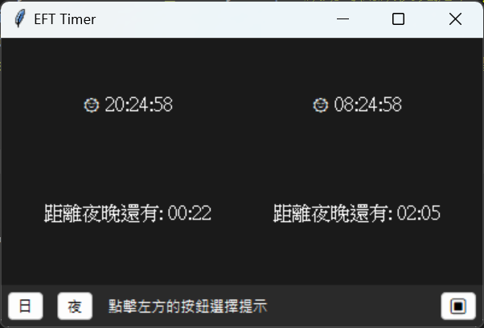
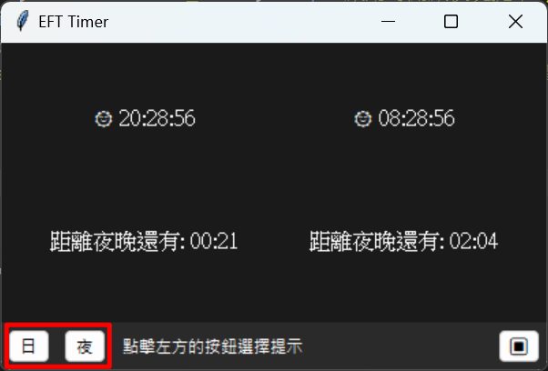

# EFTTimer
每次想做夜晚先可以做嘅任務嗰陣，
一打開EFT
冇夜圖

Language: [粵語](readme.md)/揼過文檔比Ai幫你翻譯咪得囉[^m]/...
---

# 特點
 - 用Tkinter製作, 唔需要安裝任何依賴
 - 支持啟動參數
 - 提醒功能: 等到有日/夜圖就響鐘

# 安裝依賴
```
tkextrafont
pyinstaller
```

```
pip install -r ./requirements.txt
```
> pyinstaller 用嚟打包exe嘅，如果唔用嘅話可以忽略
>
>tkextrafont 用嚟加載字體文件嘅。而家仲未用到

# 下載
## 原始碼編譯
### 下載項目
```bash
git clone https://github.com/SvCpu/EFTTimer.git
```
> 如果你唔識用Git命令嘅話, 你可以直接下載呢個項目嘅壓縮檔
### 編譯
下載項目後執行命令
```bash
cd EFTTimer
pip install -r ./requirements.txt
pyinstaller ./eft_timer.spec
```
>請確保你已經安裝 Python3 環境(我用嘅係3.11.9)

## Releases
下載發佈頁面嘅exe，直接打開就得
[Releases](https://github.com/SvCpu/EFTTimer/releases)

# 使用方法
## 直接打開執行檔

顯示時間對應遊戲內時間

## python指令啟動
```bash
python eft_timer.py
```

### 提示功能
撳左下方嗰兩粒掣啟動

等到有日/夜圖就會響鐘

## 啟動參數
### 開日圖提醒
`--wait_sun`, `-l`

### 開夜圖提醒
`--wait_night`, `-n`

### 曬成熒幕顯示
`--maximize`, `-m`

### 設置更新時間間隔（1-60秒）
`--update_time`, `-u`
>即係個timer嘅時間幾秒變一次
### api
`--api`, `-a`
返回類似格式嘅資料
```json
{
    "left": {
        "time": "00:30:05",
        "is_night": true,
        "next_phase": "light",
        "countdown": "00:29"
    },
    "right": {
        "time": "12:30:05",
        "is_night": false,
        "next_phase": "night",
        "countdown": "01:29"
    }
}
```
>實際返回嘅資料冇換行
>同埋我只係`print`咗啫
>
>用api其實係我諗唔到起咩名

## 改提醒音效
改`sound_player.py`文件`play_alert` methods 就得
要用非阻塞方法

# 免責聲明
呢個項目同 `Battlestate Games` 無關, 只係我用嚟睇有冇夜圖嘅一個小工具

如果發現問題或者有乜意見請提出issue

# 引用版權說明
呢個Git倉庫包含嘅字體文件`MindEscape.ttf`
因為我覺得呢個字體好似塔克夫嘅字體
來自[onlinewebfonts](http://www.onlinewebfonts.com)

以下係來自網站的版權要求
```html
<div>Fonts made from <a href="http://www.onlinewebfonts.com">Web Fonts</a> is licensed by CC BY 4.0</div>
```

# 授權條款
本項目採用 [Attribution-NonCommercial-ShareAlike 4.0 International](https://creativecommons.org/licenses/by-nc-sa/4.0) 授權條款

[^m]: 就是叫你用 AI 翻譯啦